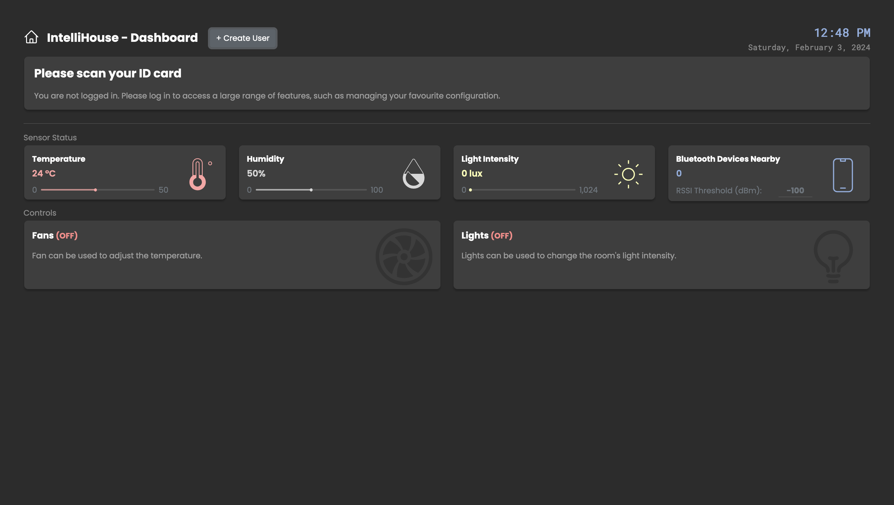

# IoT Dashboard

Project for 420-531-VA (Internet of Things)

<!-- add image here -->

## Hardware Prerequisites

- Raspberry Pi 4 (or equivalent compatible board)
- ESP8266 or ESP32 microcontroller

- The GPIO are setup as follows

| Function      | Pin (RPi) | Pin (ESP8266)                                                                               |
|---------------|-----------|---------------------------------------------------------------------------------------------|
| LED           | 17        |                                                                                             |
| DHT11         | 4         |                                                                                             |
| Motor EN      | 23        |                                                                                             |
| Motor IN1     | 24        |                                                                                             |
| Motor IN2     | 25        |                                                                                             |
| Photoresistor |           | A0                                                                                          |
| RFID Reader   |           | Refer to [this](https://www.aranacorp.com/en/using-an-rfid-module-with-an-esp8266/) article |

## Software Prerequisites

- [Python](https://www.python.org/downloads/) 3.10+
- [Node.js](https://nodejs.org/en/download) 18.0+
- [Mosquitto](https://mosquitto.org/download/) MQTT Broker 2.0+

## Getting Started

Create a file `.env`, containing the following
```
NOTIFICATION_EMAIL=<notification recipient>

EMAIL_ADDRESS=<email address>
EMAIL_PASSWORD=<email password>
```

Run the following commands to install the required libraries

```bash
pip install -r requirements.txt
npm install
```

Make sure that the mosquitto broker is running, then run the following terminals simultaneously (on different terminals)

1. Bluetooth packet listener

```bash
sudo node bluetooth.js
```

2. IoT Dashboard

```bash
python app
```

